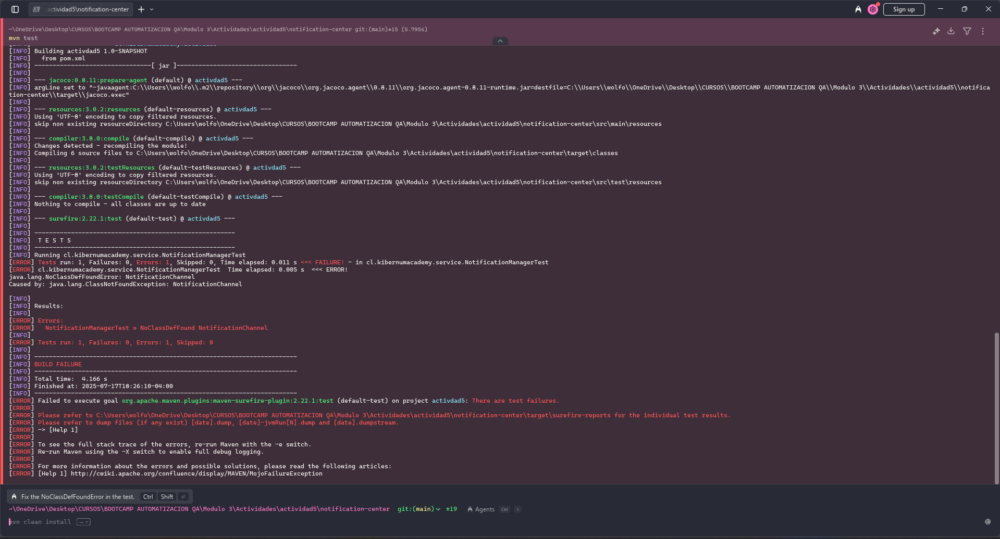
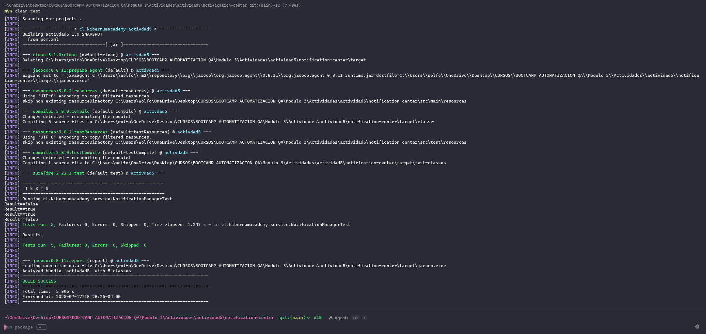
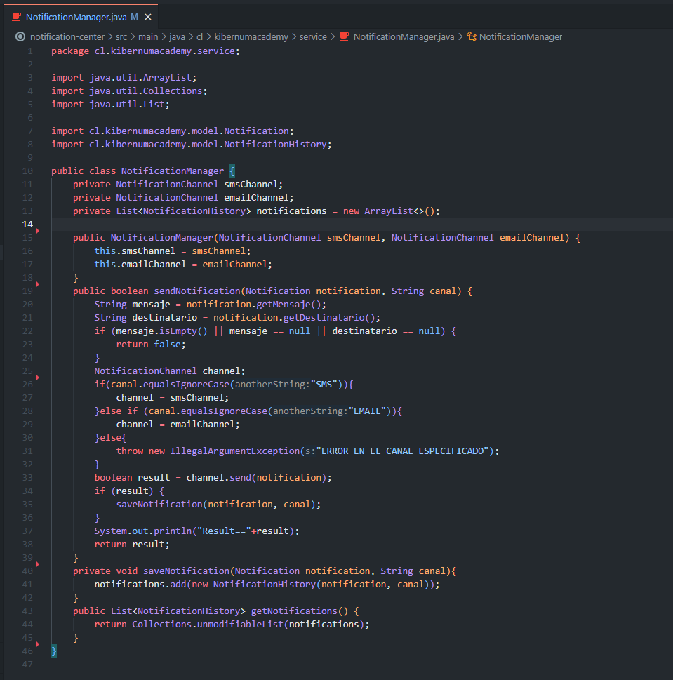
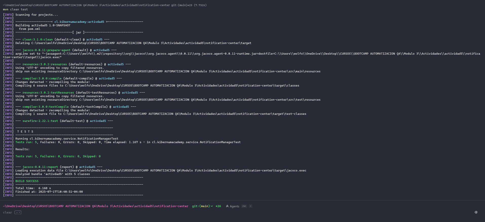
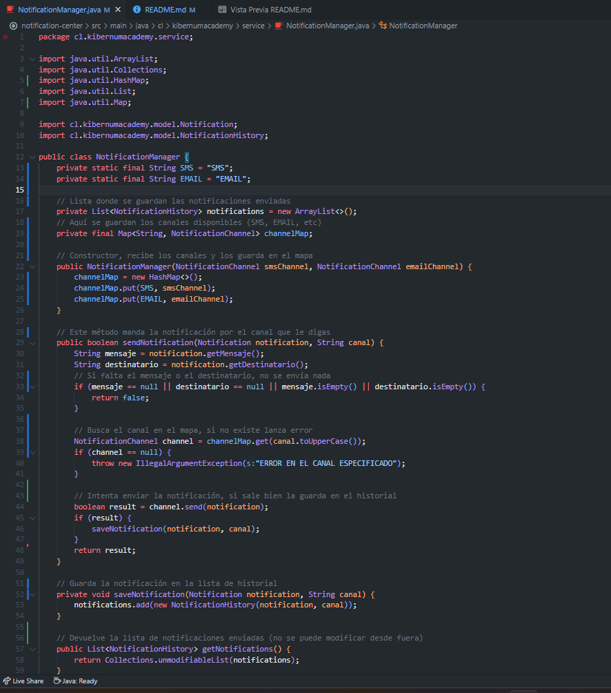

# Kibernum-Modulo3-Actividad5

# Testing de un Sistema de Notificaciones Utilizando Mockito

### Módulo 3 - Sesión 5 - Actividad 5

### Equipo 4: 
- Felipe Lobos

## Gestor de Productos con JUnit 

### RED
Test en zona roja

### GREEN
tests en zona verde

Código fuente en zona verde

### REFACTOR
tests

código refactorizado

